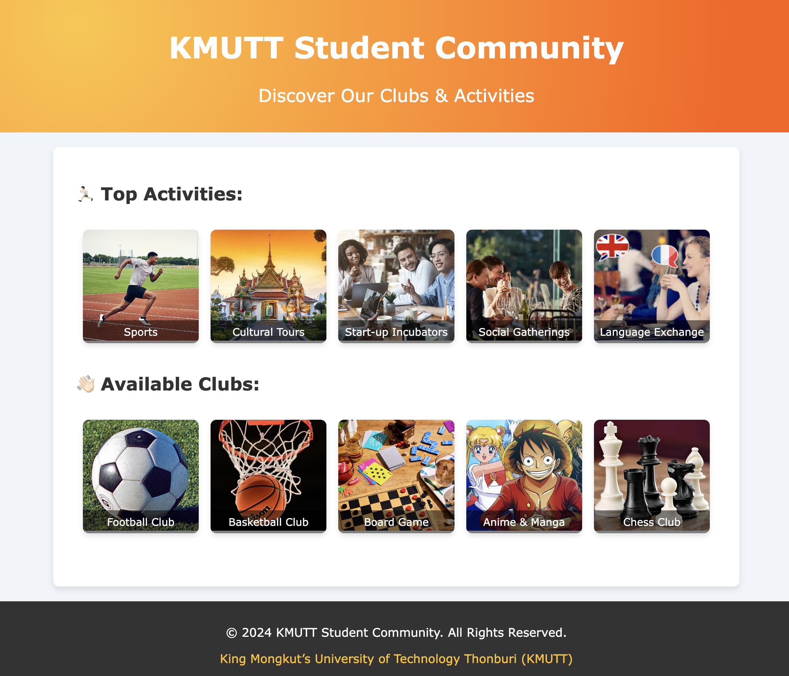

# ⚙️📝 Lab Instructions: Section 1 - Create a University Activities and Clubs Website



## 🎯 Objective:
Create a visually appealing website for the KMUTT Student Community to showcase top activities and available clubs using HTML and CSS.

## ⚙️ Materials Needed:
- A text editor (e.g., VSCode, Sublime Text, Atom)
- A web browser (e.g., Chrome, Firefox)
- Image files for activities and clubs (provided separately)

## 📝 Instructions:

### 1. Project Setup

- Download the [project template](https://drive.google.com/file/d/1jUm2u1bMoZInfG9NTeC4qtA7uiqK9-Xh/view?usp=sharing) or set up manually following these steps:
    - Create a new project folder named `KMUTT_Student_Community`.
    - Inside this folder, create two files: `index.html` and `styles.css`.
    - Create a subfolder named `img` to store all the images.
- File directory should be:
```
.
└── KMUTT_Student_Community/
    ├── img/
    │   ├── activites/
    │   │   ├── cultural-tours.jpeg
    │   │   ├── languageExchange.jpeg
    │   │   ├── running.jpeg
    │   │   ├── social.webp
    │   │   └── startup.webp
    │   └── clubs/
    │       ├── anime.jpeg
    │       ├── basketball.jpeg
    │       ├── boardgame.jpeg
    │       ├── chess.jpeg
    │       └── football.jpg
    ├── index.html
    └── styles.css
```
### 2. HTML Structure

- Open `index.html` in your text editor.
- Define the basic structure of an HTML document with `<html>`, `<head>`, and `<body>` tags.
- In the `<head>`, include a link to the CSS file and set the page title to "KMUTT Student Community".
- In the `<body>`, create the following sections:
  - A header section with the main title "KMUTT Student Community" and a subtitle "Discover Our Clubs & Activities".
  - A content section with two subsections: "Top Activities" and "Available Clubs".
  - A footer section with copyright information and a link to KMUTT's official website.

### 3. CSS Styling

- Open `styles.css` in your text editor.
- Set the base font and background color for the `body`.
- Style the header to include a gradient background and center-aligned text with contrasting colors.
- Style the content section to have a white background, padding, and a box shadow for a card-like appearance.
- Ensure that headings within the content section are styled for visibility and consistency.
- Style the rows to be flexible and responsive, wrapping items as necessary.
- Style the image boxes to have rounded corners, shadows, and ensure images fit well within their containers.
- Add a semi-transparent overlay for captions on images.

### 4. Adding Content

- Within the content section in `index.html`, create two rows:
  - The first row for top activities.
  - The second row for available clubs.
- For each row, create image boxes that include an image and a caption. Ensure the paths to images are correct.

### 5. Footer

- Style the footer to have a background color that contrasts with the content section, center-aligned text, and padding.
-  footer requirement: 
    - The footer should contain the text: "© 2024 KMUTT Student Community. All Rights Reserved."
    - Include a hyperlink to "King Mongkut’s University of Technology Thonburi (KMUTT)" website: https://www.kmutt.ac.th/en/

### 6.  Shadow and Gradient Code
- To create a shadow effect for the image boxes, use the following CSS code:

```css
.img-box {
    box-shadow: 0 4px 6px rgba(0, 0, 0, 0.1);
}
```
- This code sets a box shadow with a slight blur and transparency, creating a subtle shadow effect around the image boxes.

- To create a gradient background for the header, use the following CSS code:
```css
.header {
    background: radial-gradient(circle at 10% 20%, rgb(255, 197, 61) 0%, rgb(255, 94, 7) 90%);
}
```
- This code sets a radial gradient that transitions from a yellow color (rgb(255, 197, 61)) to an orange color (rgb(255, 94, 7)), starting from the top left corner and spreading outwards.

### 7. Test and Validate

- Open `index.html` in your web browser to see the final result.
- Ensure all images are displayed correctly and all styles are applied as expected.
- Validate the HTML and CSS using tools like the W3C Markup Validation Service and CSS Validator to ensure there are no errors.

## Useful Tools (Additional) 
- [Gradient Refferences](https://gradients.shecodes.io/gradients)
- [Shadow Refferences](https://getcssscan.com/css-box-shadow-examples)


## Final Notes:
- Ensure all image paths are correct relative to the `index.html` file.
- Feel free to customize the text content and styles to add a personal touch.
- Experiment with different color schemes and fonts to see how they affect the overall design.

By following these instructions, you will create a cohesive and visually appealing website for the KMUTT Student Community. Use the provided image resources and aim to match the design shown in the example image.
